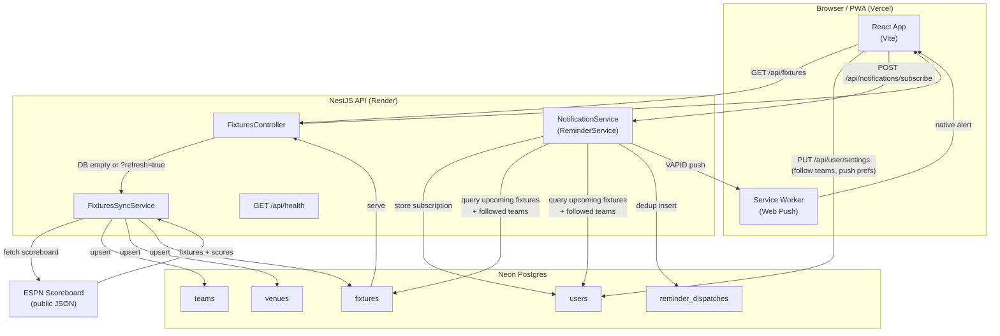

# FIFA World Cup 2026 — Fixtures PWA

Zero-budget Progressive Web App that shows day-grouped WC 2026 fixtures and delivers native Web Push notifications before kickoff. No paid APIs — fixtures and scores are pulled on-demand from ESPN's public scoreboard.

**Stack:** NestJS + TypeORM + Neon Postgres (API) · Vite + React (web) · Render (API host) · Vercel/Netlify (web host)

---

## Project layout

```
api/    NestJS backend (Render-ready)
web/    Vite + React PWA shell (Vercel/Netlify-ready)
```

## Requirements

Node **22.13.1** (`engine-strict=true` enforced via `.npmrc`). Run `nvm use` if using nvm.

---

## Quick start

### 1. Database

Create a free [Neon](https://neon.tech) Postgres database, set `DATABASE_URL` in `api/.env`, then apply migrations:

```bash
cd api && npm run migration:run:local
```

### 2. API

```bash
cd api
cp .env.example .env   # set DATABASE_URL at minimum
npm install
npm run migration:run:local
npm run start:dev       # http://localhost:3000
```

Fixtures are hydrated on first request. Call `GET /api/fixtures?refresh=true` to re-sync scores from ESPN at any time.

### 3. Web

```bash
cd web
cp .env.example .env
npm install
npm run dev             # http://localhost:5173
```

Vite proxies `/api/*` to `localhost:3000` in dev — leave `VITE_API_BASE_URL` unset locally.

---

## Migrations

```bash
cd api
npm run migration:show         # list pending / applied
npm run migration:run:local    # apply pending
npm run migration:revert       # roll back last
```

On Render, migrations run automatically during the build step (`render.yaml`).

---

## Tests

```bash
cd api && npm test
cd web && npm test
```

---

## Deploy

| Layer | Where | Notes |
| :--- | :--- | :--- |
| API | Render (Root Dir: `api`) | Set `DATABASE_URL`, `VAPID_*` env vars. Health check: `GET /api/health`. |
| Web | Vercel / Netlify | Set `VITE_API_BASE_URL` to your Render API URL. |

---

## Push notifications (Phase 7)

Generate VAPID keys and add to `api/.env`:

```bash
npx web-push generate-vapid-keys
```

Required env vars: `VAPID_PUBLIC_KEY`, `VAPID_PRIVATE_KEY`, `VAPID_SUBJECT`.

Users configure notification timing (5 min → 1 day before kickoff) and followed teams from the `/settings` page.

---

## Architecture



---

## Key design decisions

- **On-demand hydration:** fixtures are fetched from ESPN only when the DB is empty or `?refresh=true` is passed — always user-triggered.
- **Normalized schema:** `teams` and `venues` are lookup tables; fixtures and followed-team preferences reference their IDs.
- **One push per match:** `reminder_dispatches` deduplicates on `(user_id, fixture_id)` so no duplicate alerts.
- **Zero-cost infra:** Web Push (VAPID) only — no SMS, no paid notification gateway.
